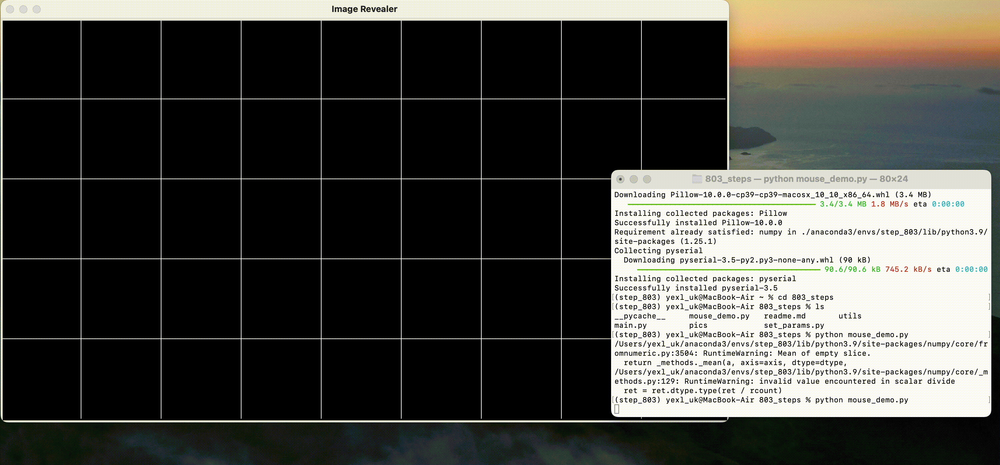

# 如何使用803-step源代码

## 引言

803-step源代码服务于艺术项目[游感803Step](https://mp.weixin.qq.com/s/cLjXAjdAkpo5IwnYtkFUNw)，于2023年6月初在浙江展览馆展出，Verimake主要负责了艺术想法的可视化和交互功能。

本篇文章中的源代码包括：

1. 介绍如何通过雷达芯片实现最终在浙江展览馆中实际呈现出的，与一定范围内行人的交互。
2. 提供一个鼠标交互程序demo可供参考。

## 1. 软件和硬件的准备

### 1.1 硬件准备

除了用来跑python程序的一台电脑，如果想实现与人行动的交互，需要准备一片雷达芯片，并且放置在想要布置区域的最前方。

（雷达的信息）

### 1.2 软件准备

#### 1.2.1 安装anaconda和配置python

803-step源代码的运行环境是python3.9。我们可以通过安装anaconda配置python环境，本站也给出了完整流程的教程[Anaconda安装以及“Hello world!"程序](https://verimake.com/d/70-anaconda-python-hello-world)。

结束安装教程的流程后，我们可以在终端中确认python的安装以及版本。打开电脑的`终端` 或`Terminal` 。

- 在MacOS中我们可以进入启动台，搜索“终端”；
- 在Windows系统中我们可以点击开始，搜索“Anaconda Prompt”。

本篇教程以MacOS为例。在终端中输入python。如果出现以下界面则已经完成python环境的安装。


- 如果有报错，可以尝试输入python3

从上图可以看到Python 3.10.9是本机的python版本，比我们需要3.9新。所以可以通过配置虚拟环境来得到我们需要的版本。

#### 1.2.2 配置虚拟环境 

我们先创建一个python 3.9版本的虚拟环境来专门运行step-803的代码。如果还停留在上一步的终端界面，先输入`exit()` 回到命令行中。

输入`conda create -n step_803 python=3.9 -y` 创建名叫`step_803` 的环境。终端中会跳出一些信息，当出现如下界面的时说明创建完成。


#### 1.2.3 安装运行需要的包

通过输入`conda activate step_803` 来激活虚拟环境，进入到我们刚新建的环境`803_step`中；输入`conda deactivate` 返回最初的环境。如果左边括号里的base变成虚拟环境的名称就激活成功了。


运行803-step的源代码需要额外安装这几个包：opencv；tkinter；pillow；numpy和pyserial。在命令行中输入如下代码：

```shell
pip install opencv-python	   
pip install tk						
pip install Pillow				
pip install numpy					
pip install pyserial
```

有的包可能会下载较久时间。运行结束后，我们的事前准备就完成了。


## 2. 在terminal中运行可视化程序

### 2.1 下载源代码并进入803_steps目录

在GitHub上下载我们的源代码。点击[803_steps链接](https://github.com/tungsten106/803_steps/tree/simplified)，有两种方法下载。

#### 2.1.1 通过git clone

在打开的终端中，输入指令直接通过git下载

``````shell
git clone https://github.com/tungsten106/803_steps/tree/simplified
``````

然后在终端中继续输入：`cd 803_steps` 进入源代码文件夹。

#### 2.1.2 直接下载ZIP文件

点击GitHub页面上的绿色Code按钮。然后选择Download ZIP。

解压后选择在解压后的文件夹中打开终端。

### 2.2 执行程序

不管是哪一种方法，我们都需要返回新建的虚拟环境`803_step`。

#### 2.2.1 无硬件demo版（鼠标交互版）

我们首先介绍如何使用demo版。在终端中输入`python mouse_demo.py`；

第一次加载可能要稍等一会，根据电脑配置反应速度也会不一样。等一个黑色的5\*9方格的窗口出现后，就可以和它交互了。



#### 2.2.2 正式版（需要硬件雷达）

如果是正式版，需要先连接雷达。我们将雷达通过USB串口接入电脑。

同样我们在终端中执行程序。在终端中输入`python main.py` ，程序会自动检测电脑接入的USB端口设备，例如：


程序会需要指定一个设备作为雷达的输入。在光标处输入串口对应的USB设备ID，比如如果是第一个就输入0，第二个就输入1。

如果输入正确就会跳出如2.2.1一样的5\*9方格窗口，如果输入的不是数字程序就会自动中止。此时只需要再执行一次`python main.py` 就可以再次启动程序。


## 3. 调整参数

803_step程序中可以调整的参数有两个，分别是程序窗口的大小（画布大小）及雷达感应范围的四个顶点坐标。参数调整主要是通过`set_params.py` 这个文件。它的内容如下：

```python
# 设置画布大小
canvas_width, canvas_height = 1086, 600

# 四个角的坐标，需要人工校对
# 顺序是屏幕的左上-右上-右下-左下，依次校对。
input_points = np.float32([[1136,1147],     # 左上
                           [-1227,1250],    # 右上
                           [-1345,2400],    # 右下
                           [1300,2430]])    # 左下
```

### 3.1 画布大小

画布大小指的是5\*9程序窗口的大小。默认设定是1086\*600，你可以根据自己电脑的分辨率和需求进行更改。

如果需要将画布变得更大，并保持原始尺寸，以下是一些参考方案。如果想更改，只需要把第二行更改成如下任何一行，或者以（长，宽）的形式填入自己希望的数字。

```python
canvas_width, canvas_height = 1920, 1080
canvas_width, canvas_height = 2048, 1280
```

但需要注意的是，改得越大（超过2048）有可能会产生卡顿。

### 3.2 （正式版）校对雷达感应范围

游感803Step的主要交互是基于一块方形地毯，而行人站在上面的位置对应了demo中鼠标的位置。而雷达芯片是将位置坐标传递给程序的重要部件。为了获取尽量精准的对应坐标，需要对窗口的各个顶点在现实中的对应位置进行校对。

步骤很简单。当我们成功运行2.2.2中的程序以后，程序会不断打印出雷达捕捉到的人物坐标，格式为一行两个数字。站在相对应5\*9窗口左上角的位置半分钟，直到得到一个相对稳定的输出。按照左上-右上-右下-左下的顺序，依次进行校对。

随后将得到的坐标依次填入`set_params.py` 中含有`input_points` 的变量中，如下：

```python
input_points = np.float32([[1136,1147],     # 左上
                           [-1227,1250],    # 右上
                           [-1345,2400],    # 右下
                           [1300,2430]])    # 左下
```


